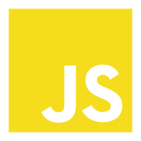

# Hi bro, I'm AnLijun（安利君）. 👋

  
  
Why do I call myself AnLijun，which likes a salesman's name.
 
  
Because I usually recommend people around me to learn web technology.
 
  
And I've done a lot of demos.  
 
  
In Chinese, the demo can be translated as ＂anli."

  
That's why I call myself Anlijun.

<h6>月下独酌</h6>

李白

<ul>
  <li> 花间一壶酒，独酌无相亲。</li>
  <li> 花间一壶酒，独酌无相亲。</li>
  <li> 月既不解饮，影徒随我身。</li>
  <li> 暂伴月将影，行乐须及春。</li>
  <li> 我歌月徘徊，我舞影零乱。</li>
  <li> 醒时相交欢，醉后各分散。</li>
  <li> 永结无情游，相期邈云汉。</li>
</ul>
  
  

<h2 align="left" id="macropower-tech">Favorite</h2>
 Tools, languages, and other things that I like to work with.
 <table>
  <tr>
    <td align="center" width="96">
      
       Html
    </td>
    <td align="center" width="96">
      
       Css
    </td>
    <td align="center"  width="96">
      
       Sass
    </td>
    <td align="center" width="96">
      
       JavaScript
    </td>
    <td align="center" width="96">
      
       TypeScript
    </td>
    <td align="center" width="96">
      
       Vue
    </td>
  </tr>
</table>
---

